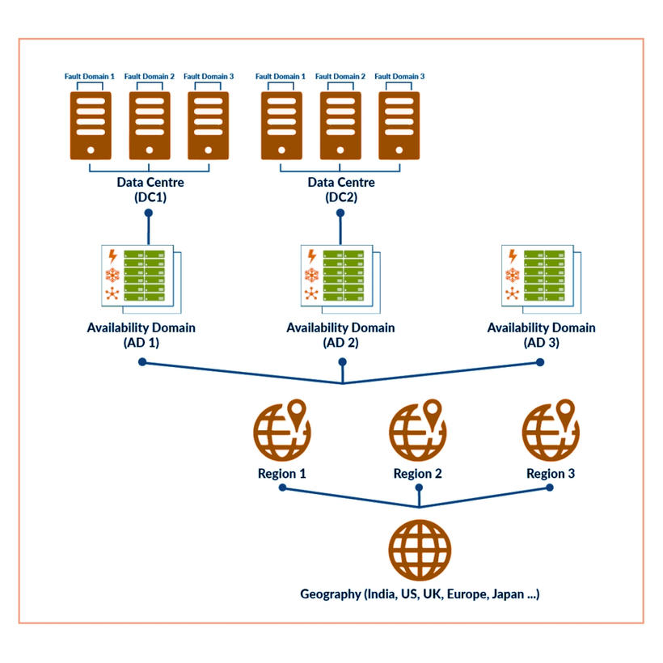

# OCI architecture

# What Is a Region?

A **region** is a localized geographic area in the world where Oracle has cloud data centers.
Each region has **one or more availability domains (ADs)**, which are one or more large, fault-tolerant data centers that work together to keep services running smoothly and reliably.

OCI has a worldwide network of regions across many continents (more than 45 active regions and over 100 Availability Domains globally as of recent data). This helps users run their workloads close to their customers and end-users, reducing latency.

Oracle also provides special deployment options, such as:

* A partnership with Microsoft Azure that lets OCI and Azure work together smoothly (multicloud interconnect).
* A hybrid cloud service called **Dedicated Region Cloud@Customer** (also known as OCI Dedicated Region), which lets companies use the full suite of OCI services (IaaS, PaaS, SaaS) in their own data centers or colocation facilities.

## How to Choose a Region

When you choose a region, keep these three things in mind:

* **Distance from your users**: Choose the region closest to your users. This helps your application work faster and reduces delay (latency).
* **Data laws and compliance / data residency**: Some countries have strict rules about where data must stay (data sovereignty). Pick a region that meets these legal rules. Oracle offers multiple regions in many countries and sovereign cloud options (e.g., EU Sovereign Cloud) for strict compliance.
* **Service availability**: Not all regions have every OCI service at launch. Some services are rolled out later depending on demand, capacity, or local regulations.

Choosing the right region helps you get the best performance, follow rules, and use the right services.

# What Is an Availability Domain?

An **Availability Domain (AD)** is one or more physically isolated, strong, and safe data centers in a region.

Each AD is separate (isolated from others) to stop problems from spreading, but they are linked by a fast, low-latency, high-bandwidth network. This lets users run workloads across multiple ADs for high availability.

Key characteristics:

* ADs do **not** share power, cooling, or network systems.
* If one AD has a problem (e.g., fire, flood, power outage), the other ADs in the same region usually keep working fine.
* ADs are connected with high-speed, low-latency networks, so data moves quickly between them.
* Availability domains are fault-tolerant and very unlikely to fail simultaneously.

For example, if a region has three ADs and one goes down, the other two will still work.

**Note**: Some OCI regions (especially newer or sovereign/government regions) have **only one AD**, but fault domains still provide strong protection within that single AD.

# What Is a Fault Domain?

Each Availability Domain contains **exactly three Fault Domains (FDs)**.

A fault domain is a grouping of hardware and infrastructure (e.g., servers, racks, power distribution, top-of-rack switches) within an availability domain. Fault domains provide **anti-affinity** — they let you distribute instances so they are **not** on the same physical hardware.

If you place your compute instances, databases, or other resources in different fault domains, a failure in one FD (hardware crash, network issue in that group) does not affect the others.

## Benefits of fault domains

* Protect your applications from hardware failures, planned maintenance, or software update issues in a single FD.
* OCI updates or patches only one fault domain at a time, so others keep running.
* You can explicitly choose which fault domain to use when launching compute instances, VM DB systems, bare metal DB systems, or instance pools (or let OCI automatically select with best-effort anti-affinity).

# How to Design for High Availability

To build resilient architectures in OCI:

* Each region has availability domains (1 or more), and each AD has **exactly three** fault domains.
* Spread your application / compute instances / databases across **different fault domains** (anti-affinity) to survive hardware or maintenance issues.
* For higher protection, replicate your setup across **multiple Availability Domains** (intra-region HA with very low latency).
* For disaster recovery or maximum resilience, replicate across **multiple regions** (cross-region replication, backup, or active-active setups).
* To keep databases highly available and in sync, use tools like **Oracle Data Guard**, **Oracle RAC** (Real Application Clusters — can span fault domains or ADs), Autonomous Database, or GoldenGate.

By using these layers, your system stays online even if one FD, one AD, or even one region has issues.

# What If There's Only One Availability Domain?

Even in regions with only **one Availability Domain** (common in many newer, government, or sovereign regions), **fault domains provide strong protection**.

By spreading your resources across the **three fault domains**, you avoid single points of failure at the hardware level and keep your systems running without interruptions for most common outages (hardware, maintenance, partial power issues).

# Summary of What We Learned

Let's review:

* A **Region** is a geographic area with one or more isolated data centers (e.g., Tokyo, London, Mumbai, Ashburn).
* Each region has **one or more Availability Domains (ADs)** — isolated from each other.
* Each AD has **exactly three Fault Domains (FDs)** — hardware groupings for anti-affinity.

These parts protect your system at different levels:

* **Fault Domains** → protect against small hardware failures, maintenance, or issues within one rack/group (lowest level).
* **Availability Domains** → protect against big data center failures (power, cooling, network at AD scale).
* **Regions** → can work in pairs or multiples for backup, disaster recovery, and data residency.

Oracle also provides **Service Level Agreements (SLAs)** — typically 99.95% or 99.99% for most services (higher in multi-AD regions for some services like Compute), guaranteeing high availability, performance, and reliability.

# Conclusion

Oracle Cloud Infrastructure (OCI) is designed with regions, availability domains, and fault domains to keep your applications safe, highly available, and always running. By spreading your resources across these layers (fault domains → ADs → regions), you can avoid failures, reduce downtime, meet data residency and compliance rules, and build production-grade, resilient cloud applications.