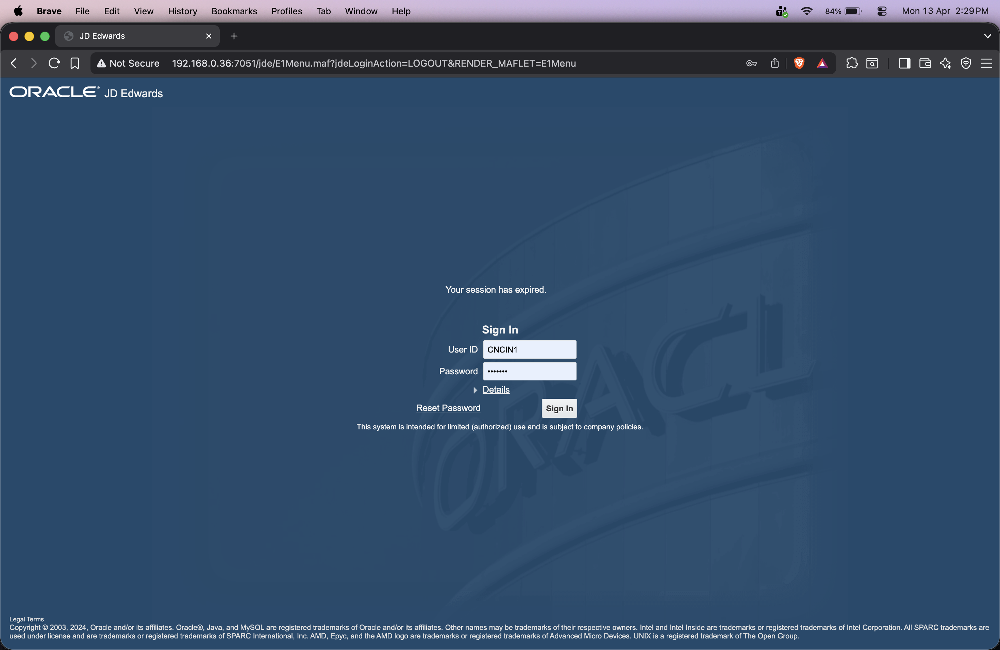

# How to Create a User in JD Edwards (JDE) EnterpriseOne

## Step 1: Log in to JD Edwards EnterpriseOne

Open your web browser and navigate to the JD Edwards EnterpriseOne login page.

### What you see:
The **Sign In** screen will appear with the following fields:

| Field        | Description                                      |
| ------------ | ------------------------------------------------ |
| **User ID**  | Your JDE administrator username (e.g., `CNCIN1`) |
| **Password** | Your JDE administrator password                  |

      

## Step 2: JDE EnterpriseOne Home Screen

After successfully logging in, you will be taken to the **JD Edwards EnterpriseOne Home Screen**.

### What you see:
You are now inside **JD Edwards EnterpriseOne 9.2 – Release 24**.

### What to do next:
To create a new user, you need to navigate to the **User Security** application. This is done through the **Fast Path** (quick search bar) or through the menu.

---

            

## Step 3: Navigate to User Security Application Using Fast Path

To create a new user in JDE, you need to open the **User Security** application.
The quickest way to do this is by using the **Fast Path** search bar.

### What is Fast Path?
> 💡 **Fast Path** is a quick navigation tool in JDE EnterpriseOne. Instead of browsing
> through menus, you can directly type an **application ID / program number** and jump
> straight to it. This saves a lot of time for experienced users.

### What is P0092?
> **P0092 – User Security (User Profile Revisions)** is the JDE application used to:
> - Create new users
> - Edit existing user profiles
> - Set user preferences (date format, language, environment, etc.)
> - Assign default roles and environments to users

---

    

## Step 4: Work With User / Role Profiles Screen

After selecting **P0092**, the **Work With User / Role Profiles** screen will open.

### What you see:
This screen displays a list of all existing JDE users and roles.
Currently it shows **"No records found."** as no filter/search has been applied yet.

### Key options on this screen:

| Option                   | Description                            |
| ------------------------ | -------------------------------------- |
| **Both Users and Roles** | Shows both users and roles in the list |
| **Users Only**           | Filters the list to show only users    |
| **Roles Only**           | Filters the list to show only roles    |

### What to do:
To create a new user, click the **`+` (Add) icon** in the toolbar at the top.

> The `+` icon is the standard JDE button to add/create a new record
> in any application.

---

## Step 5: User Profile Revisions Form

After clicking the **`+` icon**, the **User Profile Revisions** form will open.
This is where you fill in all the details to create a new JDE user.

---

### Section 1: Basic User Information

| Field               | Description                                                         | Important Notes                                                                                                                  |
| ------------------- | ------------------------------------------------------------------- | -------------------------------------------------------------------------------------------------------------------------------- |
| **User ID** ⭐       | The unique login name for the new user                              | Required field. Max 10 characters. No spaces allowed. Usually follows a naming convention like `FIRSTNAME.L` or department code. |
| **Address Number**  | Links the user to an existing Address Book record (person/employee) | Optional but recommended. This connects the JDE user to their employee/vendor record in the Address Book (P01012).               |
| **WhosWhoLineID**   | Identifies a specific contact line within the Address Book record   | Leave blank unless your organization uses multiple contacts per Address Book entry.                                              |
| **Batch Job Queue** | Defines which server queue processes this user's batch/report jobs  | Leave blank to use the system default queue.                                                                                     |

> ⚠️ **User ID Rules:**
> - Must be **unique** across the entire JDE system
> - **Maximum 10 characters**
> - **No spaces** or special characters

> 💡 **Address Number Explained:**
> In JDE, every person/company has an **Address Book Number**. Linking it here
> ties the JDE login user to a real person in the system. This is important for
> workflows, approvals, and audit trails.

---

### Section 2: Display Preferences

| Field             | Description                                                                                          |
| ----------------- | ---------------------------------------------------------------------------------------------------- |
| **Language**      | Sets the display language for this user. Leave blank for the system default (usually English).       |
| **Justification** | Text direction — **Right To Left** (e.g., Arabic/Hebrew) or **Left to Right** (default for English). |

---

### Section 3: Accessibility

| Field                      | Options      | Description                                                                                      |
| -------------------------- | ------------ | ------------------------------------------------------------------------------------------------ |
| **Set Accessibility Mode** | Yes / **No** | Enable only if the user requires screen reader or accessibility tool support. Default is **No**. |

---

### Section 4: User Mode

| Option           | Description                                                                    |
| ---------------- | ------------------------------------------------------------------------------ |
| **Standard** ✅   | Full JDE interface — for regular business users and administrators.            |
| **Simplified**   | A simplified, limited interface — for occasional or basic users.               |
| **Service-only** | For system/service accounts that run automated processes, not for human login. |

> 💡 For most regular employees, keep this set to **Standard**.

---

### Section 5: Report Submission

| Field                          | Options      | Description                                                                                                        |
| ------------------------------ | ------------ | ------------------------------------------------------------------------------------------------------------------ |
| **Always Use Default Printer** | Yes / **No** | If set to Yes, all reports print to the user's default printer automatically without prompting. Default is **No**. |

---

### Section 6: Date & Localization Settings

| Field                         | Description                                                                                        |
| ----------------------------- | -------------------------------------------------------------------------------------------------- |
| **Date Format**               | How dates are displayed for this user (e.g., MM/DD/YY, DD/MM/YY). Leave blank to use system value. |
| **Date Separator Character**  | The character used between date parts (e.g., `/` or `-`).                                          |
| **Decimal Format Character**  | Defines decimal display (e.g., `.` or `,` depending on country).                                   |
| **Localization Country Code** | Sets country-specific formatting rules. Leave blank if no special localization needed.             |
| **Universal Time**            | UTC offset for the user's time zone.                                                               |
| **Time Format**               | 12-hour or 24-hour clock format.                                                                   |
| **Daylight Savings Rule**     | Applies daylight saving time adjustments for the user's region.                                    |

> ⚠️ **Important:** For most users, leave the Date & Localization fields **blank**
> so they inherit the system default values. Only fill these in if the user is
> in a different country/region than the system default.

---

### What to do:
1. Enter the **User ID** — this is mandatory (marked with ⭐).
2. Enter the **Address Number** if available.
3. Leave all other fields as default unless specifically required.

---

## Step 6: Navigate to P98OWSEC – Work With User Security (Set Password)

After saving the User Profile (P0092), the next step is to set a **password**
for the newly created user. This is done through a separate application — **P98OWSEC**.

---

### Step 6a: Open P98OWSEC via Fast Path

Just like before, use the **Fast Path** search bar: and search **`P98OWSEC`**

> 💡 **What is P98OWSEC?**
> **P98OWSEC – Work With User Security** is the JDE application used to:
> - Set or reset a user's **password**
> - Define which **Data Sources** a user can access
> - Control **password change frequency** and **login attempt limits**
>
> This is a separate step from creating the user profile (P0092).
> In JDE, the **user profile** and **user security/password** are managed
> in two different applications.

---

### Step 6b: Work With User Security Screen

### What you see:

**Search Filters at the top:**

| Field              | Description                                                                        |
| ------------------ | ---------------------------------------------------------------------------------- |
| **User ID / Role** | Enter the User ID of the newly created user to search for them (e.g., `AVINASH02`) |
| **Data Source**    | Filter by a specific data source. Leave blank to search all.                       |

**Results Grid columns:**

| Column               | Description                                                |
| -------------------- | ---------------------------------------------------------- |
| **User ID**          | The JDE User ID                                            |
| **Data Source**      | The database/data source the user has access to            |
| **System User**      | The system-level database user mapped to this JDE user     |
| **User Status**      | Active or Disabled status of the user                      |
| **Change Frequency** | How often the user is required to change their password    |
| **Allowed Attempts** | Max number of failed login attempts before account lockout |
| **Retry Count**      | Current count of failed login attempts                     |
| **Security Changed** | Date when security settings were last modified             |

> ⚠️ **Important:** Until a password is set in P98OWSEC, the newly created user
> **will not be able to log in** to JDE. Setting the password here is a
> mandatory step after creating the user in P0092.

---

## Step 7: Security Revisions – Set User Password

After clicking the **`+` icon** in the Work With User Security screen,
the **Security Revisions** form opens. This is where you set the password
and security settings for the user.

---

### Section 1: User Identity

| Field       | Description                                                                     |
| ----------- | ------------------------------------------------------------------------------- |
| **User ID** | Auto-filled with the user you searched (e.g., `AVINASH02`). Do not change this. |
| **Role**    | Leave blank — this is for role-based security, not individual user setup.       |

---

### Section 2: Security Settings

| Field             | Description                                            | What to Do                                                                                                               |
| ----------------- | ------------------------------------------------------ | ------------------------------------------------------------------------------------------------------------------------ |
| **Data Source**   | The database the user will connect to                  | Leave blank to apply to all data sources, or enter a specific one if required by your organization.                      |
| **System User** ⭐ | The database-level system user mapped to this JDE user | This is a **required field**. Enter the system user as instructed by your system administrator (e.g., `JDE` or `JDESO`). |
| **Password**      | The initial login password for the user                | Enter a strong temporary password. The user should change it on first login.                                             |

---

### Section 3: User Status

| Option        | Description                                               |
| ------------- | --------------------------------------------------------- |
| **Enabled** ✅ | User can log in to JDE — select this for new active users |
| **Disabled**  | User cannot log in — used to temporarily block access     |

> 💡 Always set the status to **Enabled** when creating a new active user.

---

### Section 4: Password Control Settings

| Field                           | Description                                                       | Recommended Value                                                                       |
| ------------------------------- | ----------------------------------------------------------------- | --------------------------------------------------------------------------------------- |
| **Allowed Password Attempts**   | Max number of wrong password attempts before account locks        | Set as per company policy (e.g., `3` or `5`)                                            |
| **Invalid Password Attempts**   | System-tracked count of current failed attempts (read-only)       | Auto-populated by system                                                                |
| **Daily Password Change Limit** | How many times a user can change their password in one day        | `0` means unlimited                                                                     |
| **Password Change Frequency**   | Number of days before the user is forced to change their password | `0` means no expiry. Set a value (e.g., `90`) if your policy requires periodic changes. |
| **Password Changed**            | Date when the password was last changed (read-only)               | Auto-populated by system                                                                |
| **Security Changed**            | Date when security settings were last modified (read-only)        | Auto-populated by system                                                                |

---

### Section 5: Force Immediate Password Change

| Option                                | Description                                                                                |
| ------------------------------------- | ------------------------------------------------------------------------------------------ |
| **Force Immediate Password Change** ☐ | If checked, the user will be **forced to change their password** on their very first login |

---

## Step 8: Assign Roles to the User – Work With Role Relationships (P95921)

Search **`P95921`** in Fast Path to open the **Work With Role Relationships** screen.
This is where you assign roles to the newly created user.

### What to do:
1. The **User** field already shows `AVINASH02` (your new user).
2. From the **right panel**, select the role you want to assign
   by clicking the **radio button** next to it.
3. Click the **left arrow (←)** button in the middle to move the
   selected role to the **Assigned Roles** panel.
4. Repeat for each role that needs to be assigned.
5. Click **✔ Save** when done.

> 💡 **What is a Role in JDE?**
> A Role is a collection of permissions that controls what menus,
> applications, and actions a user can access in JDE. Instead of
> setting permissions individually per user, roles make it easier
> to manage access for groups of users with similar job functions.

---

## Step 9: Role Revisions – Confirm Role Assignment

### What you see:

| Field                | Value       | Description                                                               |
| -------------------- | ----------- | ------------------------------------------------------------------------- |
| **User**             | `AVINASH02` | The user being assigned the role                                          |
| **Role**             | `CNCADM`    | The role being assigned                                                   |
| **Effective Date**   | `13/04/26`  | Date from which the role becomes active — auto-filled with today's date   |
| **Expiration Date**  | *(blank)*   | Leave blank for permanent access. Enter a date if the role should expire. |
| **Include in \*ALL** | Checked   | Includes this role in the user's \*ALL role group                         |

> 💡 **What is "Include in \*ALL"?**
> In JDE, **\*ALL** is a special role group that combines all roles assigned
> to a user. Keeping this checked ensures the user gets the combined
> permissions of all their assigned roles when they log in.

> **Expiration Date:** Only fill this if the user needs **temporary access**.
> For permanent employees, leave it blank.

