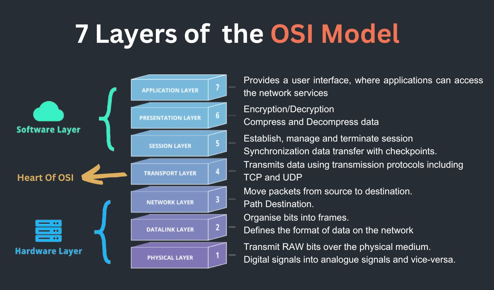

# OSI model

The **OSI Model** (Open Systems Interconnection Model) is a way to understand how data moves from one computer to another over a network.

The OSI model can work with both:
- Internet (wireless / network communication)
- Data cables (wired communication like Ethernet)

The OSI model does **not** depend on a specific medium. It only explains how communication happens step-by-step. The actual data can travel through different transmission media.

**Examples:**

1. **Using Internet / Wireless**
   - WiFi network
   - Mobile internet
   - Satellite communication

2. **Using Data Cable / Wired**
   - Ethernet cable
   - Fiber optic cable
   - USB networking

**OSI** stands for **Open Systems Interconnection**.
It is a **7-layer** architecture, with each layer having specific functionality. All these 7 layers work to transmit the data from one person to another across the globe.

This model serves as the standard for network communications, introduced in **1983**, and later adopted by ISO as an international standard in **1984**. It helps us visualize and communicate how networks operate, as well as isolate and troubleshoot networking issues.

---

## Table of Contents

- [OSI model](#osi-model)
  - [Table of Contents](#table-of-contents)
    - [Application Layer](#application-layer)
      - [Real-Time Example](#real-time-example)
    - [Presentation Layer](#presentation-layer)
    - [Session Layer](#session-layer)
    - [Transport Layer](#transport-layer)
    - [Network Layer](#network-layer)
    - [Data Link Layer](#data-link-layer)
    - [Physical Layer](#physical-layer)
  - [OSI Layer in a Nutshell](#osi-layer-in-a-nutshell)
  - [Advantages of the OSI Model](#advantages-of-the-osi-model)

---

### Application Layer

**Application Layer** is the **first layer** (Layer 7) of the OSI model.
This layer is used by end-user software or Network applications such as web browsers and email clients. This layer uses multiple protocols using different software to send and receive information and present meaningful data to users.

**Protocols:**

- **HTTP**   : used for web browsing
- **HTTPS**  : used for secure web browsing
- **FTP**    : used for file transfer
- **SSH**    : used for secure remote login (Secure Shell)
- **SMTP**   : used for sending emails (Simple Mail Transfer Protocol)
- **POP3**   : used for receiving emails (Post Office Protocol version 3)
- **Telnet** : used for remote login (Telecommunication Network)
- **POP**    : used for receiving emails (Post Office Protocol)
- **DNS**    : Converts domain names to IP addresses (Domain Name System)
- **DHCP**   : used for dynamic IP address assignment (Dynamic Host Configuration Protocol)
- **SNMP**   : used for network management and monitoring (Simple Network Management Protocol)

#### Real-Time Example

**Scenario: Opening a Website in Browser**

**Step 1: User Action**
You open your browser and type:
`https://www.google.com`

**Step 2: Application Layer Role**
- It takes your request (URL)
- Uses HTTP/HTTPS protocol to prepare a request
- Sends this request to the lower layers

**Step 3: Communication with Server**
- The request goes through all OSI layers
- Reaches Google's server
- Server processes the request and sends back response (HTML page)

**Step 4: Response Handling**
- Application Layer receives the response
- Passes the data to the browser
- Browser renders the webpage for you

**Key Point**
The Application Layer acts as a bridge between:
**User (You) ↔ Network Services**

**One-Line Summary**
Application Layer provides network services to end-user applications like browsers using protocols such as HTTP and HTTPS.

---

### Presentation Layer

- Responsible for **formatting, converting, encrypting**
- Compresses and decompresses the size of data for faster data connection
- Makes sure that data is received correctly on the other end
- Data could be lossy or lossless. Helpful in real-time video and audio.

**In short:** “It makes data readable, secure, and efficient for transmission.”

**Protocols:** SSL, MPEG, ASCII, TLS, WEP, PKI

**It handles 3 main things:**

1. **Translation** (Format conversion)
   Example: JSON ↔ binary, text ↔ image format

2. **Encryption / Decryption**
   Keeps data secure (like passwords, banking data)

3. **Compression / Decompression**
   Reduces size for faster transfer

**Example:**
Opening a secure website (banking)
- You open your bank website → HTTPS
- Browser sends request using HTTP (Application layer)
- **Presentation layer** applies encryption using **SSL/TLS**
- Data becomes unreadable (encrypted) while traveling
- On server side → decrypted back to original

**Without this layer:** Anyone could read your password

**Presentation layer** = Translator + Security guard + Compressor

**🔥 One-line answer (for interview)**
“Presentation layer ensures data is properly formatted, encrypted, and compressed so that it can be securely and efficiently understood by the receiving system.”

---

### Session Layer

**Session Layer** manages the connection (session) between two applications by **establishing, maintaining, and terminating** it.
It also synchronizes data transfer with **checkpoints**. If the connection is interrupted, it can resume from the last checkpoint.

It performs **Authentication** and **Authorization**. It can create checkpoints during data transfer and helps in reconnecting broken signals.

**Protocols:** RPC, NetBIOS, SAP, Apple Talk, Gateway

**What it actually does**

1. Establish session
2. Maintain session
3. Handles interruptions / create checkpoints
4. Terminate session

**Real-world Example**
**Logging into a website**
- You enter username/password → session starts
- You keep browsing → session is maintained
- You logout or close tab → session ends

That **login state = session**

---

### Transport Layer

**Transport Layer** ensures reliable and complete data transfer between systems.
It handles segmentation, flow control, and error handling.
It decides whether communication should be reliable or fast.

**Protocols:** TCP, UDP

**What it actually does**

1. Segmentation – breaks data into smaller packets
2. Reassembly – combines packets at receiver side
3. Error handling – detects and retransmits lost data
4. Flow control – manages data transmission speed
5. Connection management – establishes and terminates connections

**Real-world Example**
**Downloading a file**
- Data is broken into small packets
- If any packet is lost → it is resent
- All packets are reassembled correctly

Ensures complete and accurate data delivery.

---

### Network Layer

**Network Layer** is responsible for routing data from source to destination across multiple networks.
It determines the best path using logical addressing.

**Protocols:** IP, ICMP, ARP, Routing Protocols (RIP, OSPF)

**What it actually does**

1. Logical addressing – assigns IP addresses
2. Routing – finds best path for data
3. Packet forwarding
4. Path determination

**Real-world Example**
**Sending data across internet**
- Data travels from your device to server
- Passes through multiple routers
- Each router decides next best path

Like **GPS navigation for data**

---

### Data Link Layer

**Data Link Layer** ensures error-free data transfer between two directly connected devices.
It deals with physical addressing and framing.

**Protocols:** Ethernet, PPP, MAC

**What it actually does**

1. Framing – converts data into frames
2. Physical addressing – uses MAC addresses
3. Error detection – detects errors in frames
4. Flow control – controls data rate between devices

**Real-world Example**
**Communication within same network**
- Data sent from your laptop to router
- Uses MAC address for delivery
- Errors are checked before forwarding

Works within local network (LAN)

---

### Physical Layer

**Physical Layer** is responsible for transmitting raw bits over a physical medium.
It deals with hardware components like cables, switches, and signals.

**Components:** Cables, Switches, Hubs, Fiber optics

**What it actually does**

1. Bit transmission – sends 0s and 1s as signals
2. Signal conversion – converts data into electrical/optical signals
3. Data rate control – defines transmission speed
4. Physical connection – establishes hardware connection

**Real-world Example**
**Sending data through cable**
- Data converted into electrical signals
- Travels through Ethernet cable
- Received and converted back into data

This is actual physical transmission

---

## OSI Layer in a Nutshell

| Layers | Layer Name         | Responsibility                                                                              | Information Form (Data Unit) | Device                                        |
| ------ | ------------------ | ------------------------------------------------------------------------------------------- | ---------------------------- | --------------------------------------------- |
| 7      | Application Layer  | Provides a user interface. Application access network services.                             | Message                      | PC's, Phones, Servers, Gateways and Firewalls |
| 6      | Presentation Layer | Present data in a usable format. Encryption/Decryption. Compress and Decompress data.       | Message                      | Gateway                                       |
| 5      | Session Layer      | Establish, manage and terminate session. Synchronization data transfer with checkpoints.    | Message                      | Gateway                                       |
| 4      | Transport Layer    | Provide reliable process to process and error delivery. Error Checking & Data Segmentation. | Segment                      | Firewall, Gateway                             |
| 3      | Network Layer      | Move packets from source to destination.                                                    | Packet                       | Router                                        |
| 2      | Data Link Layer    | Organise bits into frames.                                                                  | Frame                        | Switch, Bridge, NIC                           |
| 1      | Physical Layer     | Transmit RAW bits over the physical medium.                                                 | Bits                         | Hub, Repeater, Modem, Cables                  |

---

## Advantages of the OSI Model

- Each OSI Layer serves a specific subnet or task
- Establish connections with different types of computers
- Supports multiple routing protocols
- Provide common reference points between network professionals
- Interoperable technology between networks and devices
- Supports connectionless and connection-oriented services
- Easily standardize router, switch, motherboard, and other hardware

